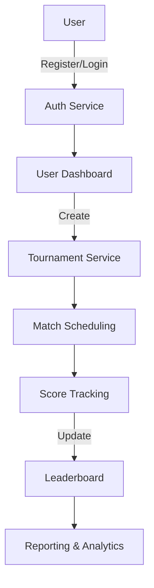

# Badminton Tournament Hub


Streamline your badminton tournaments effortlessly.

## Features

- ✓ User Registration and Authentication
- ✓ Tournament Creation
- ✓ Player Registration for Tournaments
- ✓ Match Scheduling and Management
- ✓ Score Tracking and Updates
- ✓ Notifications and Alerts
- ✓ Leaderboard and Results Display
- ✓ Reporting and Analytics
- ✓ User Feedback and Support
- ✓ Social Sharing

## Quick Start

```bash
# Clone the repository
git clone https://github.com/yourusername/badminton-tournament-hub.git

# Navigate into the directory
cd badminton-tournament-hub

# Build and run with Docker Compose
docker-compose up --build
```

## Prerequisites

| Tool          | Version |
|---------------|---------|
| Docker        | 20.10+  |
| Docker Compose| 1.29+   |
| Node.js       | 16.x    |
| Python        | 3.10+   |

## Docker Compose Setup

```yaml
version: '3.8'
services:
  app:
    build: .
    ports:
      - "8000:8000"
    environment:
      - DATABASE_URL=postgresql://user:password@db:5432/badminton
  db:
    image: postgres:15
    environment:
      POSTGRES_USER: user
      POSTGRES_PASSWORD: password
      POSTGRES_DB: badminton
  redis:
    image: redis:7
```

## API Usage Examples

```bash
# Register a new user
curl -X POST "http://localhost:8000/api/v1/users/register" -H "Content-Type: application/json" -d '{"email":"user@example.com", "password":"password123"}'

# Login
curl -X POST "http://localhost:8000/api/v1/users/login" -H "Content-Type: application/json" -d '{"email":"user@example.com", "password":"password123"}'

# Create a tournament
curl -X POST "http://localhost:8000/api/v1/tournaments" -H "Authorization: Bearer <token>" -H "Content-Type: application/json" -d '{"name":"Summer Open", "location":"Stadium A", "date":"2023-08-15", "rules":"Standard"}'
```

## Environment Variables

| Name            | Required | Default         | Description                       |
|-----------------|----------|-----------------|-----------------------------------|
| DATABASE_URL    | true     |                 | Connection URL for the database   |
| REDIS_URL       | true     |                 | Connection URL for Redis          |
| JWT_SECRET_KEY  | true     |                 | Secret key for JWT authentication |

## Architecture Diagram



## Tech Stack

| Component   | Technology       |
|-------------|------------------|
| Backend     | Python, FastAPI  |
| Frontend    | Next.js, TypeScript, Tailwind CSS |
| Database    | PostgreSQL, Redis|
| Infrastructure | Docker, Nginx, GitHub Actions |

## Documentation

For more details, please refer to the [docs folder](./docs).